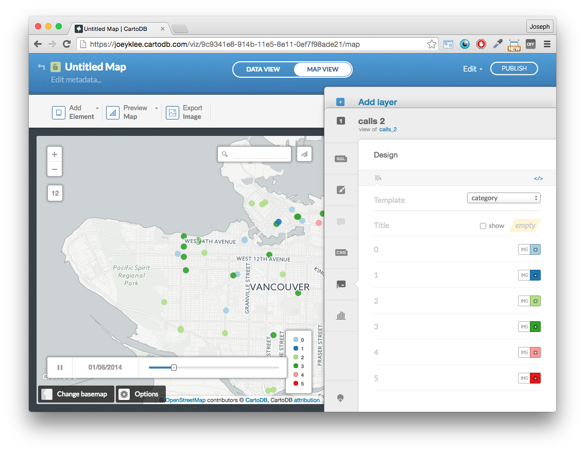
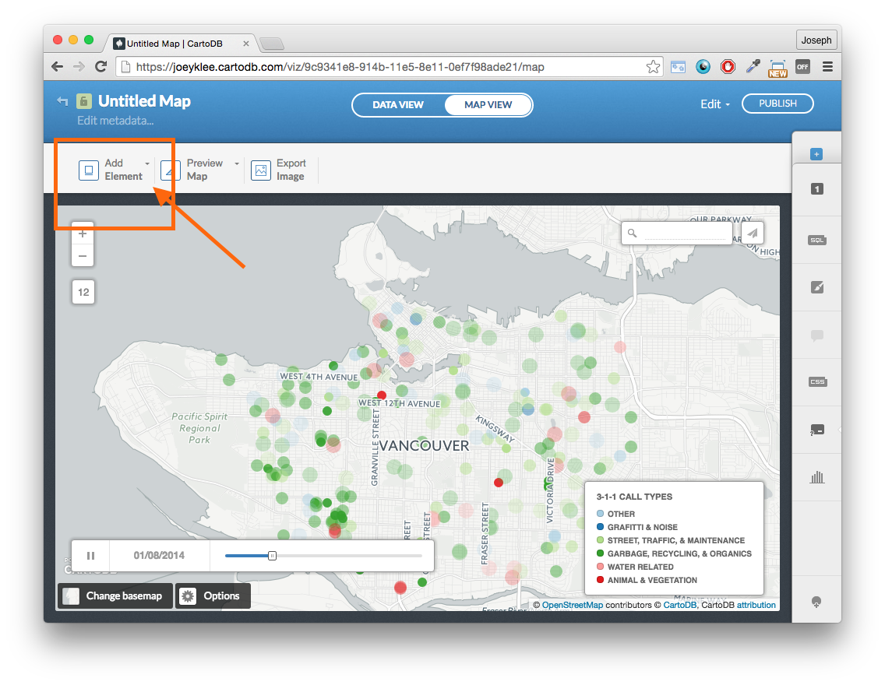

# CartoDB Teaser
date: 2015-11-22
***
## Overview
This is a quick teaser introducing CartoDB, web maps, and where you might exploring interacting with and publishing your data on the web. 

We will be exploring Vancouver's 3-1-1 maintenance service phone calls and creating an animated map of 

## Terms/Tools:

* [CartoDB](https://cartodb.com/):
	*  is a Software as a Service (SaaS) cloud computing platform that provides GIS and web mapping tools for display in a web browser. CartoDB users can use the company's free platform or deploy their own instance of the open source software. CartoDB is offered as freemium service, where accounts are free up to a certain size. For larger accounts, a fee is applied. Src: [wikipedia](https://en.wikipedia.org/wiki/CartoDB)
* [geojson](https://en.wikipedia.org/wiki/GeoJSON):
	* is an open standard format designed for representing simple geographical features, along with their non-spatial attributes, based on JavaScript Object Notation. src:[wikipedia](https://en.wikipedia.org/wiki/GeoJSON)
	* interactively make a geojson file with [geojson.io](http://geojson.io/)
*[Github](https://github.com/)
	* Guthub is awesome - 


***
## Getting Started:

### Sign-up for CartoDB:
* Sign up for CartoDB by going to [Cartodb.com](https://cartodb.com/)
	* you can login with your [google account](https://www.google.ca/) or 
	* select a **username**, **email**, and **password**

### Create a new map!
If you've just created your account, you'll get a nice prompt like this:


If you already have an account, you'll get a prompt like this:


Either way, you'll click **new map** to *create a new map*.

### Connect dataset:
Now we're going to connect our Vancouver 3-1-1 phone call data to the CartoDB database. 


We will then get a whole slew of nice options - you can see that we can directly drag and drop data, upload from Google Drive, dropbox, etc. Pretty cool!

Lucky for us, our data is stored on [Github](https://github.com/) and therefore we can link directly to it.


In the input box, copy and paste this link and clikc **submit**:

```
https://raw.githubusercontent.com/joeyklee/cartodb-van311-example/master/data/calls_1401.geojson
```

If you go to the link, you'll see a file that is structured like this (here's just a snippet): 

```
{
    "type": "FeatureCollection",
    "crs": {
        "type": "name",
        "properties": {
            "name": "urn:ogc:def:crs:OGC:1.3:CRS84"
        }
    },

    "features": [{
                "type": "Feature",
                "id": 5,
                "properties": {
                    "X": 5,
                    "Year": 2014,
                    "Month": 1,
                    "Day": 1,
                    "Hour": 10,
                    "Minute": 15,
                    "Department": "PRB - Administration",
                    "Division": "General Park Board Information",
                    "Case_Type": "PRB_Park Ranger SR",
                    "Hundred_Block": "11##",
                    "Street_Name": "W CORDOVA ST",
                    "Local_Area": "Downtown",
                    "h_block": "1100",
                    "full_address": "1100 W CORDOVA ST, Vancouver, BC, Canada",
                    "lat": 49.288287599999997,
                    "lon": -123.11927900000001,
                    "cid": 0,
                    "lat_offset": 49.2886835848809,
                    "lon_offset": -123.118948454953,
                    "timestamp": "2014-1-1 10:15:00"
                },
                "geometry": {
                    "type": "Point",
                    "coordinates": [-123.118948454952999, 49.2886835848809]
                }
            }, {
                "type": "Feature",
                "id": 6,
                "properties": {
                    "X": 6,
                    "Year": 2014,
                    "Month": 1,
                    "Day": 1,
                    "Hour": 10,
                    "Minute": 17,
                    "Department": "ENG - Streets",
                    "Division": "Traffic and Electrical Operations",
                    "Case_Type": "Sign - Repair",
                    "Hundred_Block": "8600",
                    "Street_Name": " - 8699 GRANVILLE ST",
                    "Local_Area": "Marpole",
                    "h_block": "8600",
                    "full_address": "8600  - 8699 GRANVILLE ST, Vancouver, BC, Canada",
                    "lat": 49.208433100000001,
                    "lon": -123.14039510000001,
                    "cid": 0,
                    "lat_offset": 49.208598370229801,
                    "lon_offset": -123.14012958765601,
                    "timestamp": "2014-1-1 10:17:00"
                },
                "geometry": {
                    "type": "Point",
                    "coordinates": [-123.140129587656006, 49.208598370229801]
                }
            }, ...
```

This is a **geojson** file that contains the 3-1-1 calls and the coordinates. You can find out more about how this dataset was created and run the **R code** that produced this dataset [here](http://joeyklee.github.io/aloha-r/vancouver311.html).

Now you can click **connect dataset**:


And you'll get a map of all 10,000+ points:


<center> <em>HOW EXCITING!!! </em> </center>

### CartoDB's Style Wizard
Now that we have our data plotted - let's try to make some sense of it.

One of the handiest features of CartoDB is it's style wizard. On the right hand side of the interface, notice the **paintbrush** icon - click it!


We now get a range of exciting options - try a few of them out to see what you get!


### TORQUE CAT

As you can see, there's lots to explore in the data, but for now, let's select the **torque cat** option.


**HOLY GUACAMOLE** is the map animating with the phone calls by category?!?! - YES. 

### Add proper labels to legend:
Notice that our legends just have categories from 0 to 5. Let's make sure our viewers can decode the points.

First ake your way down to the **legend** editor:


You'll notice an interface that looks like this:



First: let's **add a legend title**

Where the checkbox says **show**, check the box and type in "3-1-1 Call Types" (or whatever you deem appropriate) - notice the legend has updated


Now we need to edit our labels to our call types by clicking on the **change html** button that looks like this:

```
</>
```


If you examine the way the data was processed - 6 categories were created: (you can see in the reference section at the end of the tutorial)
	
* gaffitti & noise - 1
* street, traffic, & maintenance - 2
* garbage, recycling, & organics - 3
* water related - 4
* animal & vegetation related - 5
* other - 0

We can then write the appropriate names in the legend and click apply:

	
	<div class='cartodb-legend category'>	
	<div class="legend-title">Call Types</div>
	<ul>
		<li>
			<div class="bullet" style="background: #A6CEE3"></div> Other
		</li>
		<li>
			<div class="bullet" style="background: #1F78B4"></div> Grafitti & Noise
		</li>
		<li>
			<div class="bullet" style="background: #B2DF8A"></div> Street, Traffic, & Maintenance
		</li>
		<li>
			<div class="bullet" style="background: #33A02C"></div> Garbage, Recycling, & Organics
		</li>
		<li>
			<div class="bullet" style="background: #FB9A99"></div> Water Related
		</li>
		<li>
			<div class="bullet" style="background: #E31A1C"></div> Animal & Vegetation
		</li>
	</ul>
	</div>
	


### Last, let's add a fixed title & Description:

Click Add Element:



Now add **Title Element** -- double click to edit:

```
Vancouver 3-1-1
```

* Feel free to play with the text size and box properties

Now add **text item** -- double click to edit:

```
Maintenance hotline calls for January 2014. Learn more about the process [here]alls in January 2014. See [github.com/joeyklee](http://joeyklee.github.io/aloha-r/vancouver311.html). 
```


## Now publish!!

<iframe height="700" width="960" frameborder="0" src="https://joeyklee.cartodb.com/viz/9c9341e8-914b-11e5-8e11-0ef7f98ade21/embed_map" allowfullscreen webkitallowfullscreen mozallowfullscreen oallowfullscreen msallowfullscreen></iframe>


## You just made your first animated and interactive web map - and its amazing!!


# Reference:

```
# Determine classes to group case types:

# graffiti and noise
graffiti_noise = c('Graffiti Removal - City Property','Graffiti Removal - External Organization','PUI Noise Complaint Case','PUI Noise General Inquiry Case')

# street surface & Maintenance
street_traffic_maint = c('Street Furniture Repair and Maintenance Request','Street Cleaning & Debris Pickup','Street Light - Out','Street Tree Work Request SR','Street Litter Can Request','Streets - General Issues','Street Light - Pole Repair','Street - Surface Water Flooding','Street - Repair','Street Light - New/Relocation','Street Light - Flat Glass Fixture Request','Street and Traffic Light - Utility Damage','Street Sign - New','Crosswalk Marking - New','Boulevard Maintenance Issues','Bicycle Route Map Request','Sidewalk - Repair','Pothole - Repair','Pavement Markings Request - New/Modify','Pavement Marking - Repair','Sewer Pipe Inquiries','Sewer Manhole Issues','Sewer General Inquiries','Sewer Design General Inquiries','Sewer Separation Inspection Cancellation Case','Sewer Utility Damage','Sewer Odour Complaints','Plumbing and Gas Inspection Cancellation Case','Snow Angel Program - Individual Volunteer','Snow & Ice Removal - City Property','Snow and Ice Removal - Sidewalk Bylaw Violation','Snow and Ice Removal - Sidewalk Bylaw Inquiry','Traffic & Pedestrian Signal - New','Traffic Calming Request','Traffic & Pedestrian Signal - Modify','Traffic Sign - Modify','Street and Traffic Light - Utility Damage','Traffic Sign - New','Traffic Count Request','Truck Violation','Residential Parking Requests','Parking Meter Requests','Abandoned Vehicle Request')

# garbage, Recycling & organics related
garbage_recycling_organics = c('Missed Garbage Pickup','Abandoned Garbage Pickup - City Property & Parks','Cart - Garbage','Illegal Dumping/Abandoned Garbage Pickup','Parks Litter Can or Cart Request','Recycling Bag Request','Missed Recycling Pickup','Missed Apartment Recycling Pickup','Recycling Box Request','Cart - Apartment Recycling','Apartment Recycling - Registration Request','Transfer Station & Recycling - General Inquiries','Blue Box and Leaf Removal Guide Mail-Out Request','Missed Yard Trimmings and Food Scraps Pickup','Cart - Green (Yard Trimmings and Food Scraps)','Green Bin Program - Feedback and General Inquiry','Collection Calendar Mail-Out Request')

# water related
water = c('Water Leaks/Breaks','Water Service Turn On/Off Request','Water Service Locate Request','Street - Surface Water Flooding','Water Work Site Complaint','Water Hydrant Issue','Water General Inquiry','Water General Work Request','Water Pressure or No Water Issue','Water Conservation Violation','Water Meter Issue','Water Damage To City Water System','Catch Basin Issues')

#animal and vegetation related
animal_vegetation = c('Dead Animal Pickup Case','Animal Control General Inquiry Case','Animal Complaint - Non-Emergency Case','Animal Cremation Case','Dead Skunk Pickup','Lost Pets Case','Holding Stray Case','Chafer Beetle Feedback','Vegetation Maintenance SR','Trees and Vegetation Encroachment - City Property','Horticulture Inquiry on Right-of-Way')

# other
other = c('Poster/Sign Removal Request','Sign - Repair','Curbside Sign - New','Curbside Sign - Modify','Banner Request','Fire Reinspection Request for Firehall','Fire Reinspection Request for Inspector','Citizen Feedback','Wheelchair Curb/Ramp Request','Wheelchair','PRB_Park Ranger SR','Building Plans Information Request','Building Inspection Cancellation Case','Licence Payment Request Case','Gone Out of Business Case','FPB_General Inquiry Case','PUI General Inquiry Case','Electrical Inspection Cancellation Case','Bridges & Structures - Repair','Secondary Suite Information Request','General Information Request SR','Election General Concerns','Occupancy Permit Information Request','Home Safety Check Request Case','Flag Request','Homelessness/Transient Issue')

```
and we know the categories based on:

```
# give class id numbers:
data$cid = 9999
for(i in 1:length(data$Case_Type)){
  if(data$Case_Type[i] %in% graffiti_noise){
    data$cid[i] = 1    
  }else if(data$Case_Type[i] %in% street_traffic_maint){
    data$cid[i] = 2   
  }else if(data$Case_Type[i] %in% garbage_recycling_organics){
    data$cid[i] = 3   
  }else if(data$Case_Type[i] %in% water){
    data$cid[i] = 4   
  }else if(data$Case_Type[i] %in% animal_vegetation){
    data$cid[i] = 5   
  }else{
    data$cid[i] = 0   
  }
}

```
